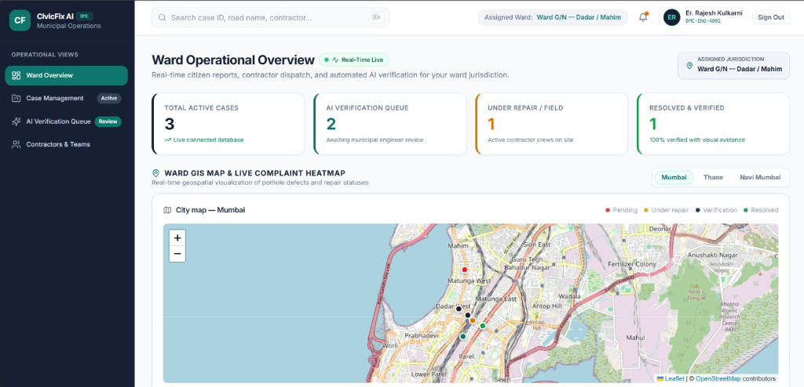
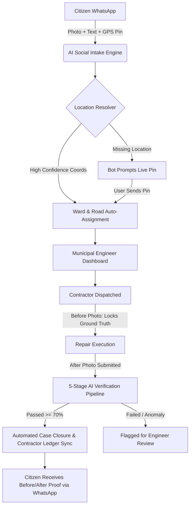
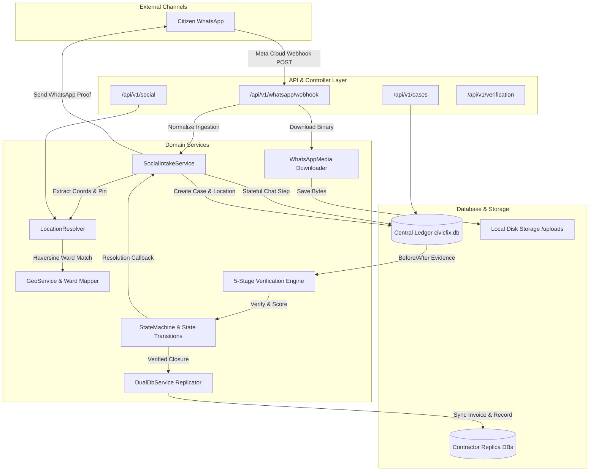

<div align="center">

# 🏛️ CivicFix AI
### *From Citizen Complaints to Verified Civic Action.*

**An autonomous municipal intelligence platform that transforms raw WhatsApp civic reports into geocoded, fraud-resistant work orders verified by Computer Vision.**

[](https://fastapi.tiangolo.com)
[](https://python.org)
[](https://react.dev)
[](https://www.typescriptlang.org/)
[](https://opencv.org)
[](https://developers.facebook.com/docs/whatsapp)
[](backend/tests)
[](https://github.com/AI-AAYUSH22/civicfix--ai)

<br />

<p align="center">
  
</p>


<br />

[Explore Features](#-core-features) • [AI Verification Engine](#-ai-verification-signature-engine) • [Architecture](#-backend-architecture) • [Quickstart](#-installation--local-setup) • [API Reference](#-api-documentation)

---

</div>

## 💔 The Problem

> *"Have you ever reported a pothole and never heard back?"*

Every year, municipal corporations receive millions of civic complaints regarding broken roads, hazardous potholes, and failing urban infrastructure. Yet the traditional civic grievance system suffers from severe operational bottlenecks:

* 🗂️ **Fragmented Reporting**: Citizens are forced to download clunky, rarely updated municipal apps or navigate confusing government web portals.
* 🌫️ **Zero Transparency**: Reports enter bureaucratic black boxes where citizens receive generic "In Progress" statuses with no real updates.
* 📑 **Duplicate Floods**: A single dangerous crater on a busy road generates dozens of duplicate tickets, overwhelming municipal engineers.
* 🎭 **Ghost & Substandard Repairs**: Contractors self-report completion using unverified photos, re-used older images, or wrong-angle shots without independent verification.
* 📉 **Accountability Deficit**: Municipal funds are disbursed without tamper-proof visual or cryptographic proof of actual repair.

**The single biggest breakdown in modern governance is not a lack of citizen complaints—it is the completely broken feedback and verification loop.**

---

## 💡 Our Solution

**CivicFix AI** closes the loop between citizens, city engineers, and contractors through an automated intake, validation, and visual verification workflow.



---

## ⚡ Why CivicFix AI is Different

<table>
<tr>
<td width="33%" valign="top">

### 📱 Zero Friction (WhatsApp)
No app downloads or registrations required. Citizens report defects naturally using WhatsApp text, voice captions, photos, and native Live Location pins.

</td>
<td width="33%" valign="top">

### 🧠 Intelligent Intake
Understands natural language descriptions, extracts landmarks and severity, and automatically categorizes defect types.

</td>
<td width="33%" valign="top">

### 📍 Deterministic Location
A 4-tier waterfall resolver guarantees that every report receives valid geospatial coordinates before reaching the dispatch queue.

</td>
</tr>
<tr>
<td width="33%" valign="top">

### 🛡️ Smart Deduplication
Spatial clustering algorithms detect nearby complaints within 20 meters, preventing redundant ticket creation.

</td>
<td width="33%" valign="top">

### 🔬 Anti-Fraud Verification
A 5-stage Computer Vision pipeline compares Before and After photos for perspective angle, background landmarks, and texture smoothness.

</td>
<td width="33%" valign="top">

### 🧾 Proof-Based Settlement
Funds and work orders are approved only after automated AI verification passes, eliminating fake or ghost contractor claims.

</td>
</tr>
</table>

---

## 🚶 The Citizen Journey

```
 1. Report                2. Understand            3. Resolve Coords        4. Dispatch
[ WhatsApp Message ] ──► [ AI Extraction ] ──► [ Location Resolver ] ──► [ Auto-Assigned ]
        │                                                                        │
        ▼                                                                        ▼
 7. Verified Proof        6. AI Verification       5. Field Execution     [ Municipal Ward ]
[ Before/After Card ] ◄── [ 5-Stage CV Pass ] ◄── [ Contractor Repair ] ◄─────────────────┘
```

1. **📱 Step 1 — Citizen Reports on WhatsApp**: A commuter spots a dangerous crater on Linking Road, takes a photo, and sends it to the CivicFix WhatsApp bot.
2. **🧠 Step 2 — AI Understands Context**: The Social Intake Engine parses the text, extracts the defect type (`pothole`), and tags severity (`High`).
3. **📍 Step 3 — Location Resolution**: If the user shared a live pin or Google Maps URL, coordinates are locked immediately. If missing, the bot prompts: *"Please tap 📎 and share your Live Location."*
4. **🏛️ Step 4 — Municipal Case Creation**: Case `#CF-299D` is created, mapped to Ward 7 (Bandra West), and assigned to the local road maintenance contractor.
5. **🛠️ Step 5 — Contractor Field Repair**: The contractor arrives, takes a **Before** photo (locking camera GPS ground truth), completes the asphalt repair, and uploads the **After** photo.
6. **🔬 Step 6 — Autonomous AI Verification**: The Computer Vision engine cross-examines GPS distance, homography perspective, peripheral landmarks, and surface texture smoothness.
7. **🎉 Step 7 — Citizen Receives Proof**: The bot sends a confirmation back to the citizen's WhatsApp with side-by-side Before/After proof and the official repair timestamp.

---

## 🎛️ Core Features

### 👤 For Citizens
* **WhatsApp Cloud Intake**: Real-time conversational reporting via Meta WhatsApp Cloud API.
* **Live GPS & Google Maps Parsing**: Support for native WhatsApp location pins, `maps.google.com`, `goo.gl/maps`, and `maps.app.goo.gl` links.
* **Multi-Turn Chatbot State**: Stateful dialogue memory (`ConversationState`) remembers active cases and guides users through location and photo follow-ups.
* **Automated Resolution Proof**: Instant confirmation receipts and post-repair Before/After photo comparisons.

### 👷 For Contractors
* **Ground-Truth GPS Locking**: Ingests "Before" repair photos on-site to lock assigned geographic anchors.
* **Before / After Enforcement**: Strict state machine constraints mandate both phases of photographic evidence.
* **Dual-Database Ledger Replication**: Verified completions and financial memos sync directly to tenant-isolated contractor databases (`contractor_ward_*.db`).

### 🏛️ For Municipal Engineers
* **Interactive GIS Command Center**: Real-time Leaflet GIS mapping with color-coded severity markers and ward boundaries.
* **Work Order Lifecycle Management**: One-click contractor dispatching, priority setting, and SLA tracking.
* **Human-in-the-Loop Override**: Ability to review borderline or flagged verification anomalies and approve/reject rework.
* **Immutable Audit Trail**: Chronological event logs recording every transition, actor, IP address, and telemetry packet.

### 🤖 For AI & Verification
* **Haversine Geofencing**: Enforces $\le 50\text{ m}$ proximity between Before and After captures.
* **ORB + RANSAC Homography**: Aligns camera perspective angles and validates scene consistency.
* **Structural Landmark Masking**: Canny edge detection verifies peripheral road structures, curbs, and buildings.
* **Sobel Texture & Cavity Analysis**: Measures cavity reduction and asphalt surface smoothness.
* **Cryptographic Tamper-Proofing**: SHA-256 binary hashing prevents duplicate or re-used images.

---

## 🔬 AI Verification (Signature Engine)

The core innovation of CivicFix AI is its **Autonomous 5-Stage Multi-Modal Verification Engine**. It determines whether the *exact assigned defect* was repaired without requiring a municipal officer to physically travel to every site.

```
                   ┌─────────────────────────────────────────┐
                   │       Before Photo  &  After Photo      │
                   └────────────────────┬────────────────────┘
                                        │
           ┌────────────────────────────┼────────────────────────────┐
           ▼                            ▼                            ▼
   [Stage 1: GPS]             [Stage 2: Perspective]       [Stage 3: Landmarks]
 Haversine Proximity Check    ORB Feature Match & RANSAC    Canny Edge Structural Mask
     Weight: 20%                  Weight: 25%                  Weight: 15%
           │                            │                            │
           └────────────────────────────┼────────────────────────────┘
                                        │
           ┌────────────────────────────┴────────────────────────────┐
           ▼                                                         ▼
   [Stage 4: Texture]                                        [Stage 5: Integrity]
 Sobel Cavity Reduction & Smoothness                       Timestamp Sequence & Expiry
     Weight: 30%                                               Weight: 10%
           │                                                         │
           └────────────────────────────┬────────────────────────────┘
                                        │
                                        ▼
                   ┌─────────────────────────────────────────┐
                   │         Weighted Decision Engine        │
                   │    Composite Score = Sum(Si * Wi)       │
                   │       Threshold: >= 0.70 (PASS)         │
                   └─────────────────────────────────────────┘
```

$$\text{Verification Score} = 0.20 \cdot S_{\text{GPS}} + 0.25 \cdot S_{\text{Perspective}} + 0.15 \cdot S_{\text{Landmarks}} + 0.30 \cdot S_{\text{Texture}} + 0.10 \cdot S_{\text{Integrity}}$$

| Stage | Algorithm | Target Metric | Purpose |
| :--- | :--- | :--- | :--- |
| **1. GPS Distance** | Haversine Spherical Formula | Distance $\le 15\text{ m}$ ($50\text{ m}$ max) | Ensures photos were taken at the exact geographic repair site. |
| **2. Perspective** | ORB Keypoints + RANSAC Homography | Inlier Ratio $\ge 40\%$ | Verifies camera angle and spatial scene geometry match. |
| **3. Landmarks** | Peripheral Canny Edge Cross-Correlation | Structural Match $\ge 30\%$ | Confirms background elements (curbs, poles, buildings) match. |
| **4. Surface Texture** | Sobel Gradient Variance & Adaptive Masking | Cavity Reduction $\ge 65\%$ | Verifies that the dark cavity is filled with smooth asphalt. |
| **5. Integrity** | SHA-256 Hashing & Sequence Validation | $T_{\text{Before}} < T_{\text{After}} \le 72\text{h}$ | Rejects identical re-uploads and expired repair timeframes. |

```
   =========================================================================================
   [ BEFORE / AFTER COMPARISON IMAGE PLACEHOLDER: Side-by-side composite artifact          ]
   [ Left: Pothole cavity detected with red bounding box                                    ]
   [ Right: Smooth asphalt repair with green verified box and telemetry overlay             ]
   =========================================================================================
```

> **Contractor invoices and work orders are approved for payment only after automated AI verification passes.**

---

## 🏗️ Backend Architecture



---

## 💬 Social Intake Engine (WhatsApp Implementation)

The `SocialIntakeService` serves as the **single unified entry point** for all conversational civic reports:

* **Meta WhatsApp Cloud API**: Listens for webhooks at `POST /api/v1/whatsapp/webhook`, validates verify tokens via `GET /api/v1/whatsapp/webhook`, and parses standard Meta Cloud JSON payloads.
* **Twilio WhatsApp Webhook**: Supports form-encoded sandbox and production payloads at `POST /api/v1/whatsapp/twilio-webhook`.
* **Automated Binary Media Downloader**: Uses `httpx` to query Meta Graph API (`/v20.0/{media_id}`), download binary images, validate magic bytes, compute `SHA-256` checksums, and store them on disk.
* **Conversational Memory (`ConversationState`)**: Implements multi-turn state tracking (`WAITING_LOCATION`, `WAITING_PHOTO`, `COMPLETED`) to match follow-up location pins to existing pending cases.
* **Outbound Reply Dispatcher**: Automatically sends formatted confirmation messages and tracking links back to the citizen's phone.

> [!NOTE]
> **Reddit integration** is currently under development and is part of the future roadmap.

---

## 🛠️ Tech Stack Matrix

| Layer | Technology | Details |
| :--- | :--- | :--- |
| **Backend Framework** | **FastAPI** | Version `0.115.0` on Python `3.12` |
| **ORM / Database** | **SQLAlchemy 2.0** | Declarative mapping, SQLite WAL & PostgreSQL ready |
| **Computer Vision** | **OpenCV & NumPy** | `opencv-python-headless 4.10`, `numpy 2.0`, `Pillow 10.4` |
| **Authentication** | **PyJWT & Bcrypt** | `HS256` stateless JWTs, Passlib with Bcrypt hashing |
| **Messaging Intake** | **Meta WhatsApp Cloud API** | Graph API `v20.0` webhooks, Twilio Sandbox support |
| **Web Frontend** | **React 18 & TypeScript** | React `18.3`, TypeScript `5.5`, Vite build tool |
| **Styling & UI** | **Tailwind CSS** | Custom design tokens, glassmorphic UI, Lucide icons |
| **GIS & Mapping** | **Leaflet & React-Leaflet** | OpenStreetMap tile layers, interactive marker clustering |

---

## 📈 Scalability & Multi-City Architecture

Can CivicFix AI scale beyond a single municipality? **Yes.**

* 🏙️ **Ward-Based Partitioning**: The schema organizes cities into hierarchical Zones, Wards, and Roads. Multiple municipal corporations can operate concurrently on the same instance.
* 🗄️ **Multi-Tenant Dual Database Ledger**: Each ward contractor operates with an isolated SQLite replica database (`contractor_ward_*.db`), offloading query traffic from the central ledger.
* ⚡ **Non-Blocking Asynchronous Processing**: Background workers (`social_worker.py`) run inside FastAPI's async event loop with cancellation tokens.
* 🐘 **Seamless PostgreSQL / PostGIS Upgrade**: The database connection string seamlessly shifts to enterprise PostgreSQL (`DATABASE_URL=postgresql://...`) with zero code alterations.
* 🔌 **Extensible Channel Architecture**: The `SocialIntakeService` is built as an abstraction layer ready to connect to additional messaging and social queues (Redis / Celery) without altering core business logic.

---

## 🏛️ Why Municipalities Choose CivicFix AI

| Traditional Municipal Portal | CivicFix AI Platform |
| :--- | :--- |
| ❌ Requires citizens to download a dedicated mobile app | ✅ **Zero-friction reporting over WhatsApp** |
| ❌ Unstructured text requires manual reading and sorting | ✅ **AI extracts landmarks, defect types, and severity** |
| ❌ Identical issues generate dozens of duplicate tickets | ✅ **Spatial deduplication merges nearby complaints ($\le 20\text{m}$)** |
| ❌ Contractors can self-certify fake or generic repairs | ✅ **5-Stage Computer Vision verification validates asphalt quality** |
| ❌ Citizens receive no feedback after reporting | ✅ **Automated WhatsApp reply with Before/After visual proof** |
| ❌ High infrastructure and deployment costs | ✅ **Lightweight, portable architecture deployable on commodity cloud** |

---

## 🔒 Security & Data Integrity

* 🔑 **Stateless JWT & Role-Based Access Control (RBAC)**: Enforces granular permissions for `citizen`, `contractor`, `municipal_officer`, and `admin`.
* ⏱️ **Constant-Time Cryptographic Protections**: Employs dummy password hashes to protect against timing attacks.
* 🛡️ **SHA-256 Media Signatures**: Computes file hashes before storage to detect corrupted or duplicate images.
* 📜 **Immutable Audit Logging**: Every state change, contractor assignment, and verification check is permanently recorded in `audit_logs`.
* 📍 **Geospatial Spoof Resistance**: Cross-checks user EXIF metadata against reported network coordinates.

---

## 🚀 Installation & Local Setup

### Prerequisites
* **Python 3.12+**
* **Node.js 18+ & npm**
* **Git**

### 1. Clone the Repository
```bash
git clone https://github.com/AI-AAYUSH22/civicfix--ai.git
cd civicfix--ai
```

### 2. Backend Setup
```bash
cd backend

# Create virtual environment
python -m venv venv

# Activate virtual environment
# Windows:
.\venv\Scripts\activate
# macOS/Linux:
source venv/bin/activate

# Install dependencies
pip install -r requirements.txt
```

### 3. Configure Environment Variables
Create a `.env` file in the project root:
```env
API_V1_STR=/api/v1
PROJECT_NAME="CivicFix AI"
DATABASE_URL=sqlite:///./civicfix.db
SECRET_KEY=civicfix-super-secret-production-key-2026-hackathon-secure
ACCESS_TOKEN_EXPIRE_MINUTES=1440

# WhatsApp Cloud API (Meta)
WHATSAPP_VERIFY_TOKEN=civicfix_token_2026
WHATSAPP_PHONE_NUMBER_ID=your_phone_number_id
WHATSAPP_BUSINESS_ACCOUNT_ID=your_business_account_id
WHATSAPP_ACCESS_TOKEN=your_meta_access_token
```

### 4. Start Backend Server
```bash
uvicorn app.main:app --reload --port 8000
```
* Interactive API Documentation: [http://localhost:8000/api/v1/docs](http://localhost:8000/api/v1/docs)

### 5. Frontend Setup
```bash
cd ../frontend
npm install
npm run dev
```
* Web Portal: [http://localhost:5173](http://localhost:5173)

---

## 📡 API Documentation

### Key REST Endpoints

| Category | Method | Endpoint | Description | Auth |
| :--- | :---: | :--- | :--- | :---: |
| **Auth** | `POST` | `/api/v1/auth/login` | Authenticate user & receive JWT token | Public |
| **Auth** | `POST` | `/api/v1/auth/register` | Register new citizen account | Public |
| **Cases** | `POST` | `/api/v1/cases` | Submit civic complaint with GPS coordinates | Bearer Token |
| **Cases** | `GET` | `/api/v1/cases` | List complaints with status/ward filters | Public |
| **Cases** | `GET` | `/api/v1/cases/{id}` | Retrieve case details, location, and evidence | Public |
| **WhatsApp** | `GET` | `/api/v1/whatsapp/webhook` | Meta Cloud API challenge verification | Public |
| **WhatsApp** | `POST` | `/api/v1/whatsapp/webhook` | Inbound Meta WhatsApp message/location receiver | Meta Secret |
| **WhatsApp** | `POST` | `/api/v1/whatsapp/twilio-webhook` | Inbound Twilio WhatsApp form receiver | Public |
| **Social** | `GET` | `/api/v1/social/pending-location` | List cases awaiting location clarification | Public |
| **Social** | `POST` | `/api/v1/social/resolve-location/{id}` | Manually resolve coordinates for a case | Public |
| **Social** | `GET` | `/api/v1/social/whatsapp-health` | Inspect WhatsApp Cloud API connectivity | Public |
| **Evidence** | `POST` | `/api/v1/evidence/upload` | Contractor Before/After photo upload | Contractor |
| **Verification**| `POST` | `/api/v1/verification/{wo_id}/review` | Municipal engineer manual verification review | Municipal Officer |

---

## 🧪 Automated Testing Suite

CivicFix AI includes a comprehensive automated test suite covering authentication, role-based guards, state machines, computer vision pipelines, multi-tenant dual databases, and social intake.

```bash
cd backend
python -m pytest -v
```


---

## 🗺️ Product Roadmap

```
  COMPLETED                    IN PROGRESS                   FUTURE ROADMAP
┌───────────────────────┐    ┌───────────────────────┐    ┌───────────────────────┐
│ • WhatsApp Intake     │    │ • Enhanced CV Models  │    │ • Reddit Ingestion    │
│ • Location Resolver   │───►│ • Multi-image fusion  │───►│ • Telegram & X (Bot)  │
│ • AI Verification     │    │ • Real-time SMS alerts│    │ • Multi-city cluster  │
│ • Municipal Dashboard │    │ • Mobile Contractor UI│    │ • PostGIS Production  │
└───────────────────────┘    └───────────────────────┘    └───────────────────────┘
```

* **✅ Completed**:
  * WhatsApp Cloud API & Twilio Webhook Intake Engine.
  * Deterministic 4-Tier Location Resolver with Google Maps unshortening.
  * 5-Stage Computer Vision & Geospatial Verification Pipeline.
  * Multi-Tenant Dual Database Replication for Ward Contractors.
  * Interactive Municipal GIS Dashboard (React 18 + Leaflet).
* **🔄 In Progress**:
  * Enhanced multi-image fusion for panoramic road repair verification.
  * Push notification worker for SMS/Email municipal alerts.
* **📋 Planned**:
  * **Reddit Integration**: Automated subreddit monitoring (`r/cityname`) and comment reply bot.
  * **Additional Social Intake Channels**: Telegram Bot, X (Twitter) mentions, and Instagram DMs.
  * **Multi-City Cluster Deployment**: Multi-region deployment with enterprise PostGIS spatial clustering.

---

## ❓ Frequently Asked Questions (FAQ)

<details>
<summary><b>Why WhatsApp instead of a standalone mobile app?</b></summary>
<br>
Citizens rarely download and keep dedicated municipal utility apps for occasional civic issues. WhatsApp is already installed on over 2 billion devices worldwide. By meeting citizens where they already are, CivicFix increases civic participation by orders of magnitude without onboarding friction.
</details>

<details>
<summary><b>What happens if a citizen does not provide a location?</b></summary>
<br>
The built-in <b>Location Resolver</b> detects low-confidence reports (< 50%) and automatically replies to the citizen via WhatsApp: <i>"We couldn't identify the exact location. Please tap 📎 and share your Live Location."</i> The conversation state is preserved, and when the user replies with a location pin, the existing case is seamlessly resolved.
</details>

<details>
<summary><b>Can contractors fake repairs using old or stock photos?</b></summary>
<br>
<b>No.</b> The 5-stage verification pipeline analyzes camera angle homography (ORB + RANSAC), peripheral background landmarks (Canny edge correlation), and cryptographic SHA-256 signatures. If a photo is reused, taken from a different location, or lacks texture smoothing, the system flags it as an anomaly for human engineer review.
</details>

<details>
<summary><b>How are duplicate complaints handled?</b></summary>
<br>
When a new report arrives, the geospatial engine checks for existing open complaints within a 20-meter radius using Haversine distance calculations. If an active case already exists, the report is linked as corroborating evidence rather than creating a duplicate work order.
</details>

<details>
<summary><b>Will CivicFix support Reddit and other social media platforms?</b></summary>
<br>
<b>Reddit integration is currently under development.</b> The architecture has been designed with a modular <code>SocialIntakeService</code> that supports additional social media intake channels in the future, allowing citizens to report civic issues through platforms they already use (Reddit, Telegram, X).
</details>

<details>
<summary><b>Does CivicFix AI require expensive cloud infrastructure?</b></summary>
<br>
<b>No.</b> The core Computer Vision algorithms (ORB, RANSAC, Sobel) are mathematically optimized in OpenCV and run efficiently on standard CPU cloud instances without requiring expensive dedicated GPU clusters.
</details>

---

## 🌟 Project Vision

> **CivicFix AI is built on a simple conviction: Transparent cities are better cities.**
> 
> By bridging the gap between citizen grievance reporting and verifiable physical action through computer vision and conversational AI, CivicFix restores trust between communities and local governing bodies—ensuring every public rupee spent on road infrastructure produces verifiable, lasting results.

---

<div align="center">

**Built with ❤️ for Smarter, Safer, and Transparent Cities.**

[⬆ Back to Top](#-civicfix-ai)

</div>
